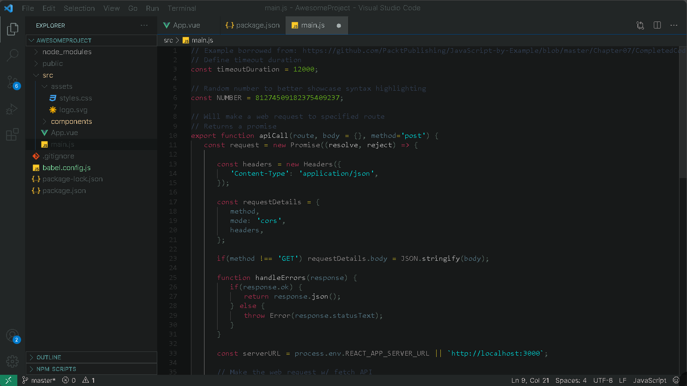

# Dimmed Theme

A Visual Studio Code theme using low-contrast dimmed colors to lessen the stress on the eyes.

## Screenshots:

  

### For more information
* [Visual Studio Code's Markdown Support](http://code.visualstudio.com/docs/languages/markdown)
* [Markdown Syntax Reference](https://help.github.com/articles/markdown-basics/)

